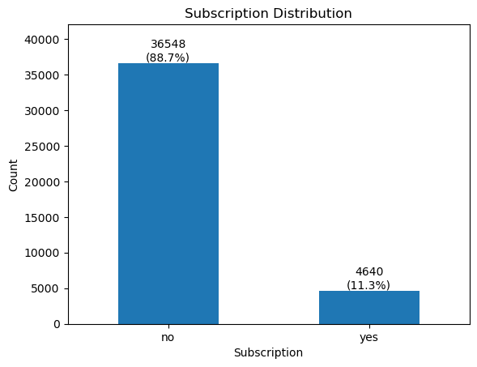

# Portuguese Bank Term Deposit Prediction

[](https://ecommerce-customer-churn-prediciton-finpro-beta.streamlit.app/)


**Final Project - Data Science & Machine Learning Program**
**Institution:** Purwadhika Digital School
**Group:**
- Lieftha Hasaz
- Muhammad Faris Ridho

---

## Project Overview

This dataset pertains to direct marketing campaigns (phone calls) conducted by a Portuguese banking institution. Often, more than one contact with the same client was required to determine if the product—a **bank term deposit**—would be subscribed to ('yes') or not ('no'). A term deposit is a financial instrument where a customer deposits a sum of money for a fixed period at a specific interest rate. For banks, these deposits are essential sources of liquidity, providing the necessary capital to issue loans to other customers.

This project utilizes the dataset to identify high-probability leads with rigorous data-driven approaches such as data cleaning, handling imbalanced data, hyperparameter tuning and threshold tuning.

## Business Context and Objective

### Problem Statement


The telemarketing process involves significant operational overhead, primarily in terms of human resources (call center staff) and time. The core challenges are:
* **Low Efficiency:** The majority of contacted customers (approximately **88%**) end up declining the offer ('no').
* **Customer Fatigue:** Repeatedly contacting disinterested customers can lead to dissatisfaction and damage the bank's reputation.
* **Resource Wastage:** Spending high operational costs and time for a low "hit rate" reduces the overall Return on Investment (ROI) of the marketing campaign.

### Goals
Based on the identified problems, this project aims to:
* **Increase Conversion Rate:** Identify the specific characteristics of customers who have a high probability of subscribing to a term deposit.
* **Cost Optimization:** Reduce the number of calls made to customers predicted to decline, allowing the marketing team to focus on high-potential prospects.
* **Data-Driven Insights:** Provide actionable recommendations to the marketing department regarding the best timing or specific customer profiles (based on socio-economic factors) for future campaigns.

## Analytical Approach

The project was approached as follows:

1. **Data Cleaning and Engineering:**
    - Handling **unknown** values and outliers.
    - Feature engineering such as `job_category` to simplify job categories and `never_contacted` to simplify `pdays`.
    - Remove features such as `duration` due to data leakage and `nr.employed` due to multicollinearity.

2. **Data Preprocessing:**
    - Data splitting using stratify to preserve the class ration in training and testing sets.
    - Perform encoding for nominal and ordinal features and scaling for numerical features.

3. **Handling Imbalanced Data:**
    - Implement techniques such as SMOTE (Synthetic Minority Over-sampling Technique) and Random Oversampling.

4. **Model Selection and Evaluation:**
    - Benchmarked several models such as Logistic Regression, K-Nearest Neighbors, and XGBoost.
    - Selected the optimal model based on F1-Score
    - Perform hyperparameter and threshold tuning to optimize performance.

5. **Cost-Benefit Analysis**
    - Helps in prioritizing between Precision or Recalling with clear cost of waste calls and missed opportunity.

## Key Results
The **LightGBM** with RandomOversampling Ratio of 0.5 was selected as the final model after hyperparameter tuning and threshold tuning to 0.27
- **Hyperparameters:** `reg_lambda`: 0.1, `reg_alpha`: 0.5, `num_leaves`: 31, `n_estimators`: 100, `min_child_samples`: 20, `max_depth`: 20, `learning_rate`: 0.05
- **F1-Score (Test):** 0.41
- **Recall (Test):** 0.65
- **Interpretation:** The model successfully captures 65% of customers who would subscribed with acceptable precision.

## Recommendation
* Marketing Team: Prioritize leads with a probability score $> 0.27$ and implement a "hard cap" on total contacts per customer to avoid diminishing returns.
* Data Science: Monitor for "Concept Drift" during interest rate hikes, as the model is highly sensitive to the Euribor 3m rate.
* Executives: Use the model to reduce operational overhead by focusing only on high-yield customer segments identified by the app.

## Model Deployment

The final model has been deployed as an interactive web application using Streamlit to facilitate real-time prediction for business stakeholders.

**Access the Application:**
[Streamlit - Bank Marketing Campaign Prediction](https://purwadhika-final-project-bank-marketing-campaign-ee637rmxquc2q.streamlit.app/)

**Application Features:**
* **Input Interface:** User-friendly sidebar for entering customer data.
* **Real-time Prediction:** Instant classification.
* **Probability Score:** Displays the model's confidence level for the prediction.


## Bank Marketing Dashboard

In addition to the interactive web app, this project also features an interactive dashboard in **Tableau** which was designed as a decision support tool for non-technical stakeholders.

**Access Link:** [Tableau Public - Bank Marketing Campaign Dashboard](https://public.tableau.com/views/Final-Project_Bank-Marketing-CampaignLiefthaFaris/DataScienceDashboard?:language=en-US&:sid=&:redirect=auth&:display_count=n&:origin=viz_share_link)

### Objectives and Key Features

1. **Executive Summary**: Key Performance Indicators (KPI) are displayed for Total Contacts, Subscribed count, Conversion Rate, and Calls Wasted count. There are also bar charts for Conversion Rate by Month and Job.
2. **Marketing Summary**: Interactive heatmap to show which age or job is associated with conversion rate by contact, pOutcome, Campaign Intensity, and Month.
3. **Data Science Summary**: Displays that the dataset is heavily imbalanced, how duration affect conversion rate, and visualizes conversion rate of age with growing economy status.

By integrating the **Streamlit** prediction model with **Tableau** monitoring, the company possesses an end-to-end solution: the model predicts *who* is likely to leave, while the dashboard provides a deep understanding of *why* the phenomenon is occurring.

## Repository Structure

```text
├── data/                            # Dataset files (Portuguese Bank Campaign)
├── model/                           # Serialized LightGBM model (.pkl)
├── notebooks/                       # EDA, Data Cleaning, and Model Training
├── app.py                           # Streamlit Web Application
├── README.md                        # Project Documentation
└── requirements.txt                 # Python dependencies (pinned versions)
```

## Installation and Usage

To replicate the analysis or run the application locally, follow these steps:

1. **Clone the Repository:**
    ```bash
   git clone [https://github.com/faris712/Purwadhika-Final-Project-Bank-Marketing-Campaign.git](https://github.com/faris712/Purwadhika-Final-Project-Bank-Marketing-Campaign.git)
    ```

2.  **Install Dependencies:**
    It is recommended to use a virtual environment (e.g., venv or Conda). Install the required libraries using:
    ```bash
    pip install -r requirements.txt
    ```

3.  **Run the Analysis (Jupyter Notebook):**
    To view the data cleaning, feature engineering, and LightGBM tuning:
    ```bash
    jupyter notebook
    ```

4.  **Run the Web Application (Streamlit):**
    To launch the interactive prediction dashboard locally:
    ```bash
    streamlit run app.py
    ```

## Tools and Technologies

- **Programming Language:** Python
- **Visualization & BI**: Tableau
- **Libraries:** Pandas, NumPy, Scikit-Learn (v1.6.1), Imbalanced-Learn, Matplotlib, Seaborn, LightGBM
- **Deployment:** Streamlit Cloud, Tableau Public
- **Model Serialization:** Pickle
- **Editor:** Jupyter Notebook, Visual Studio Code
